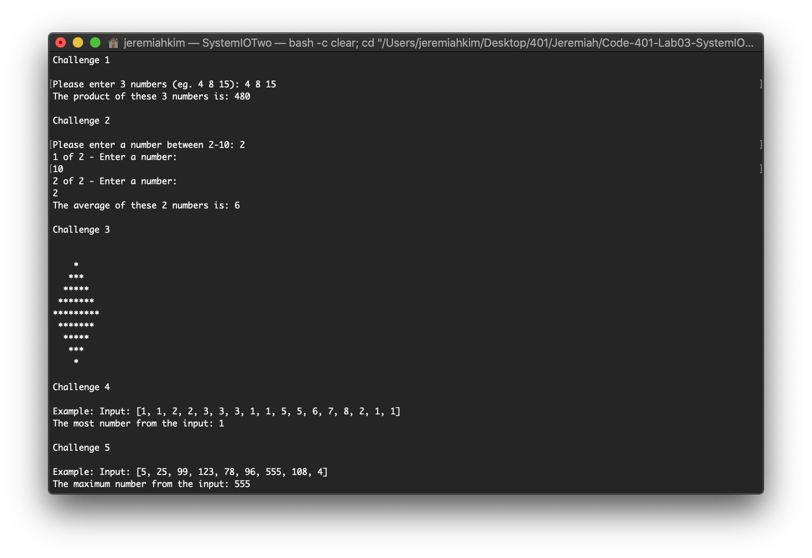
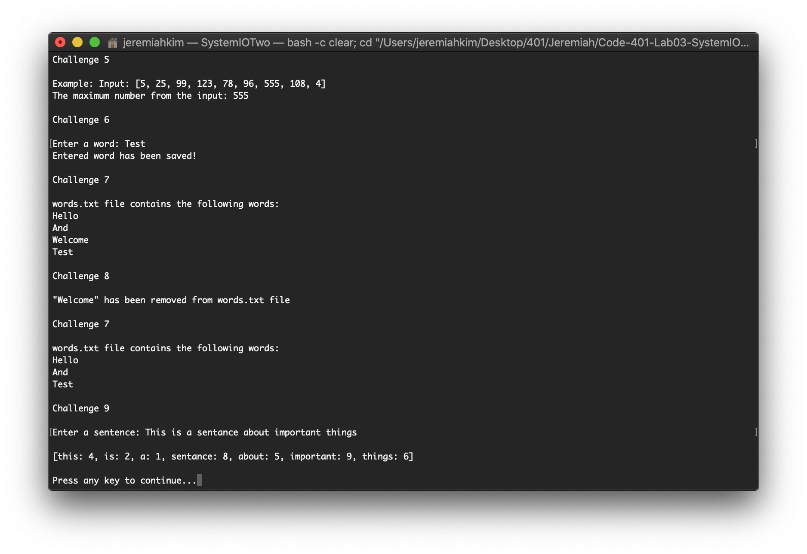

# Code-401-Lab03-SystemIO-Two


## Review of C\#

Author: Kyungrae Kim

----

## Description

The goal of this lab assignment is to evaluate my overall comfort level with C# from what I have learned so far by creating a console application that executes  various code challenges.

----

### Getting Started

Clone this repository to your local machine.

```bash
$git clone https://github.com/jeremymaya/Code-401-Lab03-SystemIO-Two.git
```

### To run the program from Visual Studio

Select ```File``` -> ```Open``` -> ```Project/Solution```

Next navigate to the location you cloned the Repository.

Double click on the ```Code-401-Lab03-SystemIO-Two``` directory.

Then select and open ```SystemIOTwo.sln```

----

### Challenges

#### Challenge 1

Write a program that asks the user for 3 numbers. Return the product of these 3 numbers multiplied together. If the user puts in less than 3 numbers, return 0; If the user puts in more than 3 numbers, only multiply the first 3. If the number is not a number, default that value to 1.

Example:

```text
Please enter 3 numbers: 4 8 15
The product of these 3 numbers is: 480
```

Tests:

* Input a string of numbers and it returns a product of all numbers
* Input more than 3 numbers
* Input of less than 3 numbers
* Can it handle negative numbers

#### Challenge 2

Create a method that asks the user to enter a number between 2-10. Then, prompt the user that number of times for random numbers.

After the user has inputted all of the numbers. Find the average of all the numbers inputted.

Specs: 1. Do not let the user put in negative numbers 2. Confirm each input is a real number

Example:

```text
Please enter a number between 2-10: 4

1 of 4 - Enter a number: 4
2 of 4 - Enter a number: 8
3 of 4 - Enter a number: 15
4 of 4 - Enter a number: 16

The average of these 4 numbers is: 10
```

Tests:

* Input different ranges of numbers and confirm averages
* Confirm input
* All numbers are 0s

#### Challenge 3

Create a method that will output to the console the following design. Pay attention to spacing.

```text
    *
   ***
  *****
 *******
*********
 *******
  *****
   ***
    *
```

Tests:

* No tests are required

#### Challenge 4

Write a method that brings in an integer array and returns the number that appears the most times. If there are no duplicates, return the first number in the array. If more than one number show up the same amount of time, return the first found.

Example:

```text
Input: [1,1,2,2,3,3,3,1,1,5,5,6,7,8,2,1,1]
Output: 1
```

Tests:

* Input different size arrays
* All numbers in the array are the same value
* No duplicates exist in the array
* There multiple numbers that show up the same amount of times.

#### Challenge 5

Write a method in that finds the maximum value in the array. The array is not sorted. You may not use .Sort()

Example:

```text
Input [5, 25, 99, 123, 78, 96, 555, 108, 4]
Output: 555
```

Tests:

* Negative numbers
* All values are the same

#### Challenge 6

Write a method that asks the user to input a word, and then saves that word into an external file named ```words.txt```

Hint: Have a file already saved in the root of your directory with a couple of words already present in the file.

Stretch:

* Tests are optional for this challenge

#### Challenge 7

Write a method that reads the file in from Challenge 6, and outputs the contents to the console.

Stretch:

* Tests are optional for this challenge

#### Challenge 8

Write a method that reads in the file from Challenge 6. Removes one of the words, and rewrites it back to the file.

Stretch:

* Tests are optional for this challenge

#### Challenge 9

Write a method that asks the user to input a sentence and returns an array that with the word and the number of characters each word has:

```text
Example: input: "This is a sentance about important things"
Output: ["this: 4","is: 2", "a: 1", "sentance: 8", "about: 5", "important: 9", "things: 6"]
```

Tests:

* Input a sentence, and it returns the correct array
* Input a sentence and confirm it returns an array
* Use different sentences with differnt symbols

----

### Visuals

#### Challenge Output Part 1



#### Challenge Output Part 2



----

### Change Log

1.0: *Lab 03 Completed* - 17 Jul 2020
